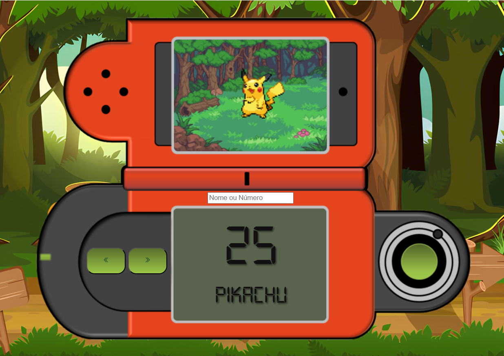

# Pokédex

Uma Pokédex web interativa desenvolvida em HTML, CSS e JavaScript, que consome a [PokeAPI](https://pokeapi.co/) para exibir informações dos Pokémon, suas imagens animadas, nomes e números. Navegue pelos Pokémon, faça buscas por nome ou número e divirta-se!

---

## 🖼️ Demonstração



---

## 🚀 Funcionalidades

- **Busca por Nome ou Número**: Encontre qualquer Pokémon digitando o nome ou número na barra de pesquisa.
- **Navegação Sequencial**: Avance ou retroceda pelos Pokémon usando os botões de seta.
- **Visual Animado**: Exibe sprites animados da geração Black/White.
- **Design Responsivo**: Layout adaptado para desktop e dispositivos móveis.
- **Mensagens de feedback**: Exibe "Loading..." durante a busca e "Not Found... :(" caso não encontre.

---

## 🛠️ Tecnologias Utilizadas

- **HTML5**
- **CSS3**
- **JavaScript**
- [PokeAPI](https://pokeapi.co/) (consumo de dados dos Pokémon)

---

## 📂 Estrutura de Arquivos

```
/
├── index.html          # Estrutura principal da Pokédex
├── style.css           # Estilos visuais e responsividade
├── script.js           # Lógica de busca, renderização e navegação
├── img/                # Imagens como pokedex.png, setas, wallpaper e favicon
├── font/               # Fonte digital para display dos números/nome
```

---

## ▶️ Como Executar

1. **Clone o repositório:**
   ```bash
   git clone https://github.com/JulianoVReis/pokedex.git
   ```
2. **Entre na pasta do projeto:**
   ```bash
   cd pokedex
   ```
3. **Abra o arquivo `index.html` em seu navegador favorito.**
   - Para experiência completa, rode em um servidor local:
     ```bash
     python -m http.server
     ```
   - Ou utilize alguma extensão de servidor local no VSCode.

---

## 💡 Como funciona?

- O usuário pode buscar um Pokémon pelo nome (ex: `pikachu`) ou número (ex: `25`).
- Ao clicar nas setas, é possível navegar para o Pokémon anterior ou próximo.
- Caso o Pokémon não exista, uma mensagem "Not Found... :(" é exibida.
- As imagens animadas são carregadas automaticamente conforme a navegação.

---

## 📱 Responsividade

A Pokédex se adapta para diferentes tamanhos de tela, mantendo a usabilidade tanto em desktops quanto em smartphones.

---

## 🙋‍♂️ Autor

Desenvolvido por **Juliano Reis**  
[LinkedIn](https://www.linkedin.com/in/juliano-reis-290b0b324/)  
[GitHub](https://github.com/JulianoVReis)

---

## 📝 Licença

Projeto de portfólio para fins educacionais e demonstração pessoal.
